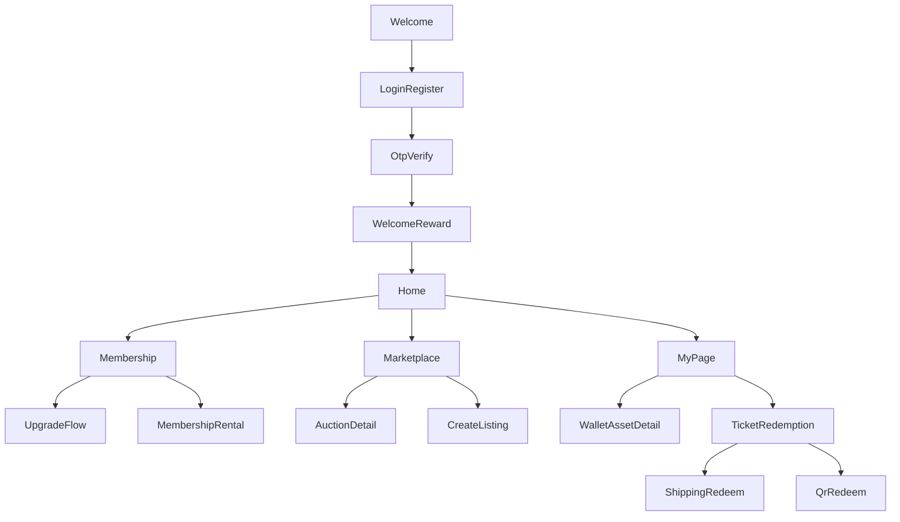

# LFC PWA Demo Requirements

## 1. 项目定位

本项目用于制作一个面向 Liverpool FC 场景的 PWA 概念 Demo，重点展示会员体系、数字资产、权益流转、票券核销与 Marketplace 交互体验。

本轮产出目标是为纯前端页面交互 Demo 提供一份可直接落地的需求文档。文档应支持后续按页面、模块和组件拆解实现任务，而不是停留在概念描述层。

## 2. Demo 边界

### 2.1 本次 Demo 要展示什么

- Liverpool FC 品牌语境下的高质感会员与权益体验
- 忠诚度积分、Membership NFT、Benefits NFT、Badge NFT 的统一钱包视图
- 拍卖、直接购买、租借、上架等 Marketplace 交互
- 票券或权益的两类核销路径
- PWA 氛围能力，如安装提示、离线态、模拟通知

### 2.2 本次 Demo 不做什么

- 不接入真实登录、OTP、支付、物流、链上网络或推送服务
- 不处理真实私钥、钱包签名、Gas、交易广播或链上确认
- 不接入真实后端；所有数据与状态均允许前端 mock
- 不追求完整业务闭环，只需保证主要交互可演示、状态切换清晰

### 2.3 Demo 实现原则

- 所有高风险或高成本能力均采用前端模拟
- 所有关键操作要有明确反馈，优先使用弹层、Toast、状态标签和时间轴
- 页面以“可讲故事”的展示顺序组织，适合现场演示

## 3. 建议技术栈

- 框架：React 18 + Vite + TypeScript
- 样式：Tailwind CSS
- 路由：React Router v6
- 状态管理：Zustand
- PWA：`vite-plugin-pwa`
- 国际化：`i18next` + `react-i18next`
- 图标：`lucide-react`
- 字体：Inter，必要时回退系统字体

## 4. 语言与内容规范

- 默认语言：English
- 支持语言：English / 简体中文 / 日本语
- 文案统一通过 `t('key')` 管理，不在页面中硬编码
- 注册页包含语言选择器；右上角导航或 `My` 页面设置中也可切换语言
- 建议语言文件路径：`src/i18n/locales/en.json`、`zh.json`、`ja.json`

## 5. 品牌与视觉语言

### 5.1 品牌色

- Primary Red：`#C8102E`
- White：`#FFFFFF`
- Charcoal：`#1A1A1A`
- Premium Gold：`#D4AF37`
- Accent Green：`#00A878`

### 5.2 体验关键词

| 关键词 | 设计表达 |
| --- | --- |
| Premium | 大量留白、精致圆角卡片、字重对比明确，高等级场景可引入黑金配色 |
| Emotional | 首页 Hero 全宽视觉、积分数字动效、欢迎奖励反馈强化情绪价值 |
| Matchday Atmosphere | 使用球场、看台、更衣室等视觉素材；倒计时与活动提示强调临场感 |
| Stadium-inspired | 会员卡借鉴球票结构，如锯齿边、编号字体、轻微弧面或压印感 |
| Collectible-driven | Badge 墙、NFT 卡片、稀有度边框与 Limited Edition 标签突出收藏属性 |
| Gamified but Elegant | 通过进度条、徽章解锁、等级升级表达游戏化，但避免廉价炫光效果 |

### 5.3 明确避免

- 银行或金融科技风格的扁平灰卡片界面
- 过度强调链上技术细节的 Crypto UI
- 赌场式拍卖氛围，例如强刺激闪烁、夸张竞价视觉

### 5.4 视觉参考

- Nike Membership：会员卡大图背景与简洁标签体系
- FIFA Ultimate Team：收藏卡稀有度边框与金属质感
- Apple Wallet：票券与二维码的沉浸式展示方式
- Discord Profile：徽章陈列与 hover 信息层
- Steam Achievements：已解锁与未解锁成就的对比关系

## 6. 信息架构

### 6.1 主要页面

1. Welcome / Auth
2. Home
3. Membership
4. Marketplace
5. My
6. Wallet Asset Detail
7. Ticket Redemption
8. Shared Modals

### 6.2 页面关系

## 7. 核心用户流程

### 7.1 登录与欢迎奖励

- 入口：Welcome 页面
- 步骤：登录或注册 -> OTP 验证 -> 登录成功 -> 弹出欢迎奖励
- 奖励内容：欢迎徽章 + 10 Points
- 反馈方式：成功弹窗、数字滚动、徽章解锁动画
- Demo 要点：OTP 可使用固定验证码或前端直接模拟成功

### 7.2 会员升级

- 入口：Home 快捷入口或 Membership 页面 CTA
- 步骤：查看当前等级 -> 对比权益 -> 选择升级套餐 -> 双重确认 -> 升级成功
- 结果：等级、权益、Membership NFT 状态同步更新
- Demo 要点：金额扣减和等级变化均为本地状态更新

### 7.3 Marketplace 出价

- 入口：Marketplace > Auctions
- 步骤：浏览拍卖卡片 -> 进入详情 -> 查看当前价格与历史 -> 输入或选择出价 -> 双重确认 -> 出价成功
- 结果：当前最高价、出价历史、剩余时间提示更新
- Demo 要点：保留防狙击规则说明，最后 30 秒可模拟延长 2 分钟

### 7.4 上架与租借

- 入口：Marketplace > My Listings 或资产详情页
- 步骤：选择资产 -> 选择 Sell / Rent -> 填写价格与周期 -> 预览 -> 确认上架
- 结果：资产状态改为 `Listed` 或 `Rental Active`
- Demo 要点：Membership NFT 支持 Rent；Benefits NFT 不支持 Rent；Badge NFT 只读

### 7.5 票券核销

- 入口：`My` 页面中的票券列表或权益卡片
- 分支一：实物权益进入收货信息流程
- 分支二：非实物权益进入二维码展示流程
- 结果：状态切换为 `Processing`、`Used` 或其他可见状态

## 8. 页面级需求

### 8.1 Welcome / Auth

**目标**

- 建立品牌第一印象，并完成登录、注册和 OTP 验证的演示

**主要模块**

- 欢迎 Hero 区
- 登录 / 注册切换
- 注册表单
- OTP 验证页
- 登录成功奖励弹窗

**注册字段**

- Username
- Password
- Email 或 Mobile
- Country
- Language
- Privacy Policy / Terms 勾选

**关键状态**

- 默认态
- 表单校验错误态
- OTP 验证成功态
- 欢迎奖励弹窗开启态

**主要 CTA**

- Sign In
- Create Account
- Verify OTP
- Claim Welcome Reward

### 8.2 Home

**目标**

- 快速展示用户身份、积分余额、会员等级和近期可参与事项

**主要模块**

- Hero Card：头像、用户名、Points、当前等级
- 快捷操作：Explore Rewards、Upgrade
- Featured Offer：限量球迷礼包 `Cultural Fusion Travel Set`，价格 `$650`
- 最近交易记录
- 即将到期提醒
- 即将举办活动

**关键状态**

- 新用户欢迎态
- 正常浏览态
- 有即将到期权益的提醒态

**主要 CTA**

- Explore Rewards
- Upgrade Membership
- View Wallet
- View Event

**素材备注**

- Featured Offer 需要单独准备一张高质感占位图

### 8.3 Membership

**目标**

- 展示等级体系、升级路径与租借权益概念

**等级体系**

- Kop Starter
- Anfield Silver
- Premium Red
- Diamond Elite

**主要模块**

- 当前等级卡片
- 下一等级进度条
- 权益对比表
- 升级套餐区
- 租借会员权益说明区

**关键状态**

- 当前等级展示态
- 可升级态
- 升级成功态
- 租借方案浏览态

**主要 CTA**

- Upgrade Now
- Compare Benefits
- Rent Access

### 8.4 Marketplace

**目标**

- 展示数字资产流转场景，体现拍卖、直购、租借和自有清单管理

**Tabs**

- Auctions
- Buy Now
- Rentals
- My Listings

**主要模块**

- 列表卡片：图片、名称、价格、卖家徽章、倒计时、状态标签
- 拍卖详情页：当前出价、出价历史、规则说明、操作区
- 创建清单页或弹层：价格、周期、类型、预览
- 防狙击规则说明：最后 30 秒延长 2 分钟

**关键状态**

- 浏览列表态
- 倒计时临近态
- 出价成功态
- 上架成功态
- 租借中态

**主要 CTA**

- Place Bid
- Buy Now
- Rent
- List Item

### 8.5 My

**目标**

- 承载个人身份、徽章收藏、票券状态与订单追踪

**主要模块**

- 个人资料卡
- Badge 墙
- Custodial Wallet 入口
- 票券管理
- 订单追踪时间轴
- Points 明细

**票券状态**

- Active
- Used
- Expired
- Cancelled

**主要 CTA**

- Open Wallet
- Use Now
- Track Order
- View Points History

### 8.6 Wallet

**目标**

- 以统一钱包卡片视图展示用户数字资产，并支持根据资产类型触发不同操作

**顶部信息**

- 截断钱包地址，例如 `0x1a2b...cd3e`
- Copy 按钮
- 总资产摘要

**筛选标签**

- All
- Points
- NFTs
- Badges

**资产分类**

| 资产类型 | 说明 | 展示方式 |
| --- | --- | --- |
| Points | 忠诚度积分余额 | 数字卡片 + 简易折线图 |
| Membership NFT | 当前会员等级身份凭证，如 `Diamond Elite #0042` | NFT 卡片，显示等级、有效期、Token ID |
| Benefits NFT | 已激活权益，例如 VIP Access、Lounge Pass | NFT 列表，显示剩余次数与到期时间 |
| Badge NFT | 收藏型勋章 | Badge 墙，点击可查看详情 |

**NFT 卡片通用字段**

- 缩略图
- 名称
- Token ID
- 状态：`Active` / `Expired` / `Listed`

**资产详情弹层**

- 全图
- 描述
- 铸造时间
- 交易 Hash
- 可用操作

**资产类型对应操作**

- Membership NFT：List for Auction / Transfer / Rent
- Benefits NFT：List for Auction / Transfer
- Badge NFT：View Only

### 8.7 Ticket Redemption

**目标**

- 展示两种不同类型权益的核销体验

#### A. 实物类权益

适用示例：旅行套装、LFC Giftset

**流程**

1. 点击 `Use Now`
2. 填写收件人姓名
3. 填写手机号码
4. 填写地址信息：Address Line 1、Address Line 2、City、State/Province、Postcode、Country
5. 查看订单摘要
6. 双重确认提交
7. 状态变为 `Processing`，展示预计配送时间

**建议组件**

- `ShippingFormModal.tsx`，或独立页面 `RedeemShippingPage.tsx`

#### B. 非实物类权益

适用示例：VIP Access、机场贵宾室、体验券

**流程**

1. 点击 `Use Now`
2. 打开全屏二维码弹层
3. 展示二维码、权益名称、有效期、核销地点与使用说明
4. 提示提升屏幕亮度
5. 点击 `Mark as Used`
6. 双重确认后更新状态为 `Used`

**建议组件**

- `QRCodeModal.tsx`

## 9. 共享组件与交互规则

### 9.1 关键 UI 模式

- Hero Card：首页顶部全宽卡片，展示用户名与 Points
- Tier Card：仿球票样式的会员等级卡
- NFT Card：顶部大图 + 底部信息区 + 稀有度标识
- Badge Wall：已解锁高亮、未解锁灰化并带锁图标
- Auction Card：商品图、当前价、卖家信息、倒计时条
- Action Buttons：主按钮为红色实心，次按钮为红色描边，确认类可使用金色强调

### 9.2 双重确认机制

所有涉及消费、竞标、升级、上架、租借、核销的动作均使用 `ConfirmModal`。

**建议流程**

1. 第一步：预览本次操作内容，例如金额、积分变动、资产变化
2. 第二步：执行最终确认

### 9.3 建议共享组件

- `ConfirmModal`
- `SuccessModal`
- `QRCodeModal`
- `ShippingFormModal`
- `AssetDetailModal`
- `LanguageSwitcher`
- `CountdownBadge`
- `StatusPill`

## 10. Demo 数据与状态约定

### 10.1 建议模拟数据

- 1 个主用户档案
- 4 个 Membership tiers
- 6 到 8 个 Marketplace 商品
- 8 到 12 个 Badge
- 3 到 5 个 Benefits NFT
- 4 条最近交易记录
- 3 条订单追踪时间轴

### 10.2 建议状态枚举

- 认证状态：`signedOut` / `otpPending` / `signedIn`
- 会员状态：`starter` / `silver` / `premium` / `diamond`
- 资产状态：`active` / `expired` / `listed`
- 票券状态：`active` / `used` / `expired` / `cancelled` / `processing`
- Marketplace 状态：`liveAuction` / `buyNow` / `rental` / `sold`

### 10.3 前端模拟规则

- 所有成功结果可在本地状态中即时反映
- 所有失败结果可通过固定 mock 分支或手动触发错误态来演示
- 时间相关能力可基于前端倒计时与本地时间推进模拟

## 11. PWA 展示能力

- 安装提示横幅：支持 Add to Home Screen 的展示说明
- Service Worker：展示离线可访问的基础页面能力
- 缓存策略：以 Cache-first 的展示逻辑表达即可
- 模拟推送通知：例如拍卖即将结束、权益即将过期
- 离线回退页：用于说明 PWA 能力，而非实现完整业务

## 12. 后续实现建议

### 12.1 前端结构建议

- `App` 负责路由、布局与全局弹层
- 页面拆分为 `Welcome`、`Home`、`Membership`、`Marketplace`、`My`
- 钱包、票券核销、拍卖详情等可采用页面加弹层混合方案
- 状态使用 mock store 集中管理，保证现场演示时切换稳定

### 12.2 实现优先级建议

1. 先完成 Welcome / Home / Membership / Marketplace / My 五个主页面
2. 再补 Wallet、Asset Detail、Ticket Redemption 两条深层流程
3. 最后补 PWA 展示能力、动效与国际化

### 12.3 素材与占位说明

- 首页礼包图需要单独制作或生成
- Hero、会员卡、NFT 卡片建议统一一套高质感视觉素材
- 如果时间有限，优先保证结构、状态与转场完整，再补精细视觉

